# Meet Your Guides

Here are the friendly characters who will guide you through the secret life of the internet:

**Dot** — A tiny glowing packet of information — your main guide.

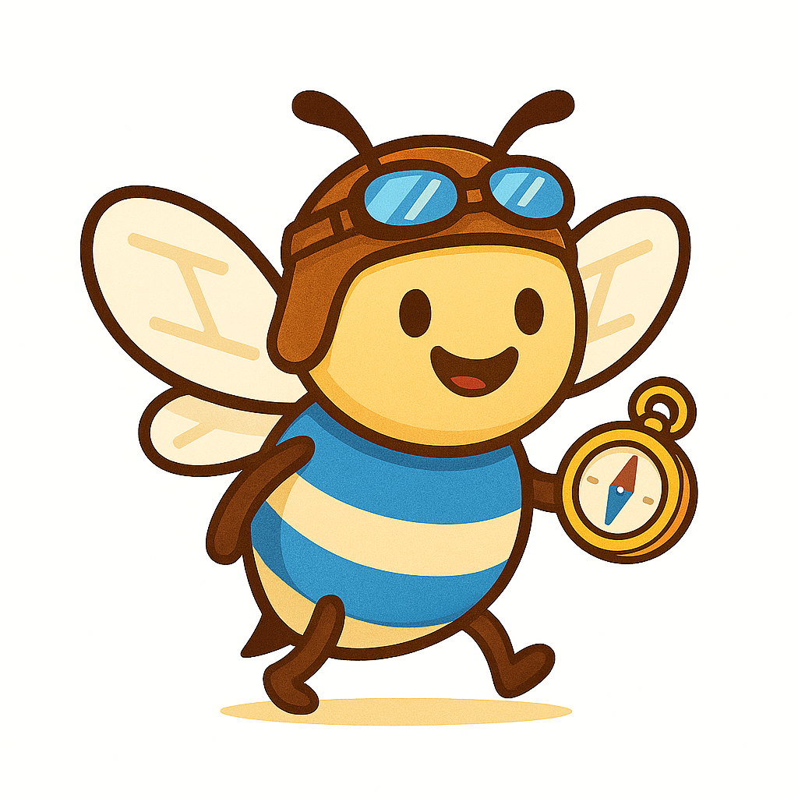
**Bee Browser** — A cheerful bee who takes you to any website.

**Willa Wi-Fi** — Invisible waves that carry signals through the air.

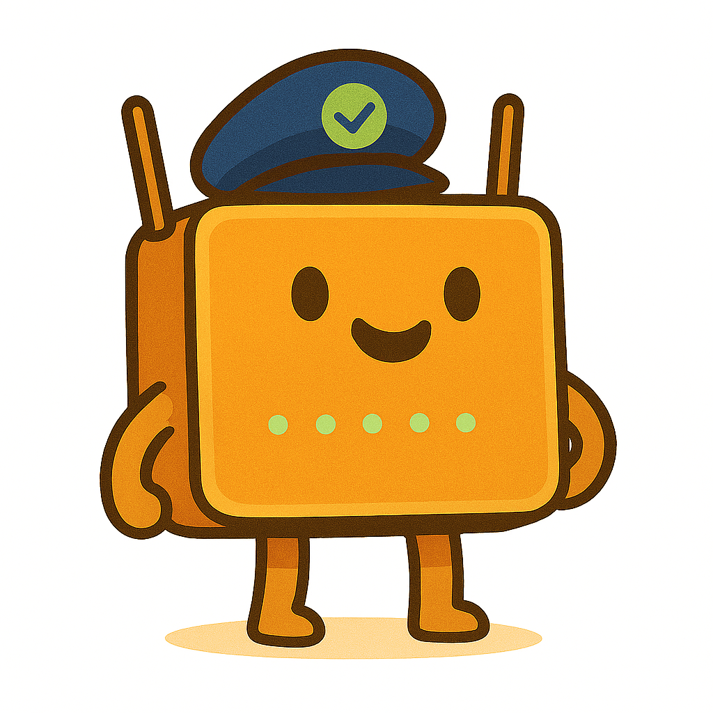
**Rory Router** — The friendly box that directs traffic in your home.

**Sunny Server** — A powerful computer that stores and sends information.

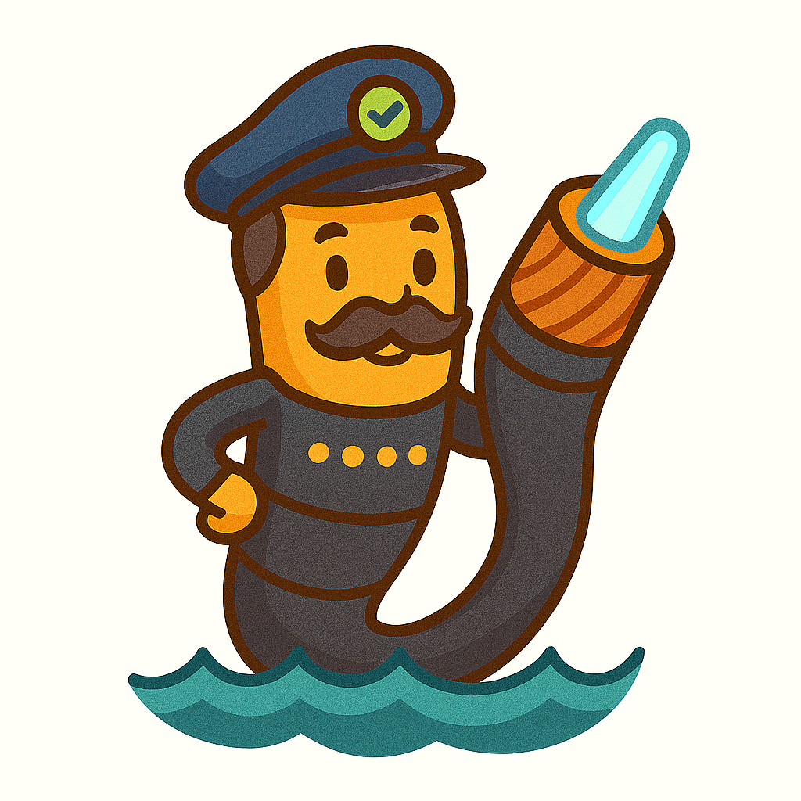
**Captain Cable** — The undersea cable that carries data across oceans.

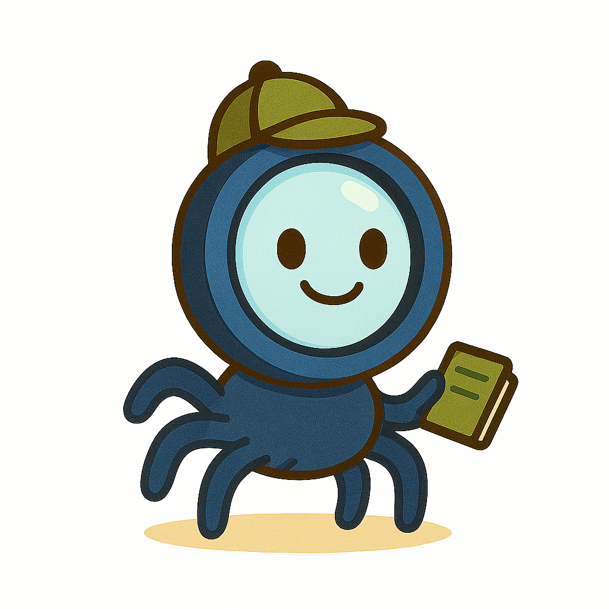
**Scout Search** — The detective who finds anything on the internet.

**Cloud Pal** — Faraway computers that store your files safely.

---

## Welcome

Welcome, explorer! In this book, we will follow tiny bits of information as they zip through homes, neighbourhoods, oceans, and giant computer buildings. We will meet friendly helpers and learn how websites, Wi-Fi, routers, servers, search engines, and the cloud all work together.

---

# What Is the Internet?

*You tap a screen, press play, and a video appears in seconds. But how does it get there? Let’s find out!*

> **Mission Start: Meet the Internet!**

## Meet Dot

One afternoon, a child named Sam tapped the tablet and pressed *play* on a video
about dolphins.

The video appeared instantly.

Sam looked up and wondered:

  “How did that dolphin video find me so fast?”

Out from the corner of the screen popped a tiny glowing dot with big curious eyes.

> **Dot:** *"Hi! I’m Dot — a little packet of information. I travel through the internet every single day. Want to see how? Follow me!"*

## The Big Picture

> **🎨 Imagine This**
>
> Imagine standing in your bedroom holding a tablet.
> Now zoom out slowly: you see your house, then your street,
> then your whole town, then the country, then the whole planet —
> and everywhere you look there are tiny glowing lines connecting
> every home, school, library, shop, and phone.
> **That huge web of connections is the internet.**

The internet is not one single thing you can touch.
It is a **network** — a system of connected devices that can
send and receive information with each other.

Right now, billions of devices around the world are connected.
Phones, tablets, laptops, smart TVs, game consoles, even some fridges —
they are all part of the same giant network.

> **⭐ Fun Fact**
>
> As of 2024, more than 5.4 billion people — over two thirds of the world’s population — use the internet.

---

## The Internet Is Like a Road System

> **🎨 Imagine This**
>
> Picture a giant system of roads.
> Every house has a driveway.
> Every driveway connects to a street.
> Every street leads to a bigger road.
> Every big road connects to a motorway.
> And motorways link whole cities and countries together.
> The internet works the same way.
> Your device connects to a small local network.
> That connects to a bigger network.
> That connects to the whole world.

You can also think of the internet as a giant mail system.
When you send a letter, it does not fly straight to the person.
It goes to a post office, then another, then another, until it arrives.
The internet moves information the same way — in small steps, very, very fast.

---

## How Your Device Connects

> **🗺️ Quick Map**
>
> **Step by step — from your screen to the world:**
>
> - Your **device** (tablet, phone, laptop) connects to your home network.
> - Your home network connects to your **Internet Service Provider (ISP)** —
> the company that brings the internet to your home.
> - Your ISP connects to bigger and bigger networks.
> - Those networks connect to the whole internet.
>

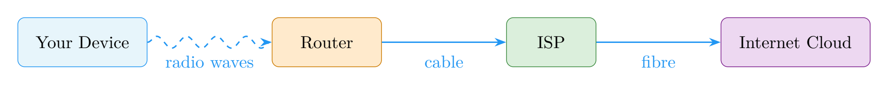

---

> **📖 New Words**
>
>
> - ****Internet**** A huge worldwide network that connects billions of devices.
> - ****Network**** A group of devices linked together so they can share information.
> - ****Device**** Any gadget that can connect to the internet — phone, tablet, laptop.
> - ****ISP**** Internet Service Provider — the company that connects your home to the internet.
> - ****Packet**** A tiny chunk of information travelling through the network (that’s me — Dot!).
>

---

> **✋ Try It**
>
> **Draw your own network!**
> On a piece of paper, draw:
>
> - Your home in the middle.
> - Three friends’ homes around it.
> - Your school in the corner.
> - The local library on the other side.
>
> Now draw lines connecting them all together.
> Congratulations — you just drew a network!
> *Can you add more buildings?  The bigger the network, the more things can talk to each other.*

---

> **💡 Big Idea**
>
> The internet is a **giant network** of billions of connected devices.
> It lets computers, phones, and tablets share information with each other
> — no matter how far apart they are.

> **Dot:** *"Great start, explorer! Now that you know what the internet is, let’s go and visit a website. Follow me!"*

# Websites and Browsers

*There are billions of websites on the internet. How do you get to exactly the right one? Let Bee Browser be your guide!*

> **Buzzing Through Website City**

## Welcome to the Website Neighbourhood

Dot had guided Sam to the edge of the internet highway.
Now it was time to visit a website.

A cheerful yellow bee wearing tiny goggles buzzed into view.

> **Bee Browser:** *"Hello! I’m Bee Browser. My job is to take you anywhere on the internet you want to go. Just tell me the address and off we fly!"*

Sam looked around.
In every direction there were colourful buildings —
a towering library, a bright game arcade, a cosy weather station,
a giant video cinema, and hundreds more stretching to the horizon.

> **🎨 Imagine This**
>
> Imagine a huge colourful city where every single building is a website.
> The library building is a news website.
> The arcade is a games website.
> The cinema is a video website.
> Each building has its very own address — and Bee Browser knows how to find them all!

---

## What Is a Website?

> **⭐ Fun Fact**
>
> There are over 1.1 billion websites on the internet, but fewer than 200 million are actively visited.

A **website** is a collection of pages stored on a special computer called a **server**.
Those pages can hold words, pictures, videos, buttons, sounds, and much more.

Every website has a unique address called a **URL**
(which stands for Uniform Resource Locator — quite a mouthful, so most people just say “web address”).

A web address looks like this:

  https://www.example.com

> **🗺️ Quick Map**
>
> **Breaking down a web address:**
>
> - https:// — a signal that the connection is *secure* (the “s” stands for secure).
> - www — short for “World Wide Web”.
> - example — the name of the website.
> - .com — the type of website (commercial, organisation, country, etc.).
>

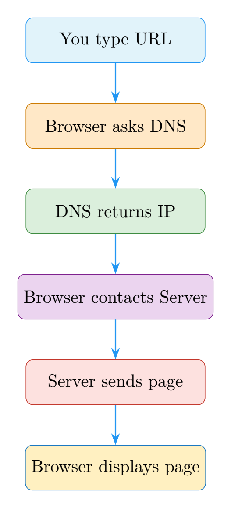

---

## What Is a Browser?

A **browser** is a programme on your device that lets you visit and view websites.

Think of it this way:

> **🎨 Imagine This**
>
> Bee Browser is like a taxi driver.
> You tell the taxi driver the address — say, www.mycoollibrary.com —
> and the taxi driver takes you straight there.
> The browser is the taxi.
> The web address is where you want to go.
> The website that appears on your screen is your destination.

Popular browsers you might recognise:

  - Chrome
  - Firefox
  - Safari
  - Edge

They all do the same basic job: **take your web address and bring the website back to your screen**.

---

## What Happens When You Press Enter?

It feels like magic, but here is what really happens in just a fraction of a second:

> **🗺️ Quick Map**
>
>
> - You type a web address and press Enter.
> - Your browser asks a special helper called a **DNS server**,
> “What is the number address for this website?”
> - The DNS server replies with the server’s **IP address** (a number like 192.0.2.1).
> - Your browser travels to that IP address and says, “Please send me your page!”
> - The server sends back the page in pieces.
> - Your browser puts all the pieces together and displays them on your screen.
>

> **Bee Browser:** *"It’s like using a phone book! You look up a name, find the phone number, and call. DNS is the internet’s phone book."*

---

## What Are Websites Made Of?

Websites are built with a special language called **HTML**
(HyperText Markup Language).
HTML is a set of instructions that tells your browser what to show:
headings, paragraphs, pictures, links, and buttons.

You do not need to know HTML to use the internet.
But it is fun to know that every website you visit is built from
these hidden instructions — like a recipe that your browser reads and cooks into the page you see.

---

> **📖 New Words**
>
>
> - ****Website**** A collection of pages on the internet, stored on a server.
> - ****Browser**** A programme (like Chrome or Safari) that lets you visit websites.
> - ****URL**** A web address — the unique location of a website.
> - ****DNS**** A system that turns website names into number addresses.
> - ****IP address**** A number that identifies a device or server on the internet.
> - ****HTML**** The language used to build web pages.
>

---

> **✋ Try It**
>
> **Match the address to the building!**
> Draw lines to match each website type to the right building:
>
>
*[See table in print edition]*

>
> *Now try opening a browser on your device and type in a web address you know.
> What building would that website be in our internet city?*

---

> **💡 Big Idea**
>
> A **website** is a place on the internet with its own address.
> A **browser** is like a taxi that takes you there —
> just type the address and it fetches the page for you.

> **Dot:** *"Now you know how to visit websites! But wait — how does your tablet even connect to the internet in the first place? Let’s visit Willa Wi-Fi and Rory Router next!"*

# Wi-Fi and Routers

*How does your tablet get to the internet if there is no wire plugged in? Willa Wi-Fi and Rory Router have the answer!*

> **Waves, Signals, and Router Magic**

## The Invisible Bridge

Before Dot could zoom off through the internet, there was a problem.

Sam’s tablet was sitting on the sofa.
There was no wire connecting it to anything.

  “How does the signal get OUT of my tablet?”

A friendly shimmer appeared in the air.
It was Willa Wi-Fi — not a person exactly, more like a warm glow of colourful waves.

> **Willa Wi-Fi:** *"That’s me! I carry signals through the air, like invisible ripples on a pond. You can’t see me, but I’m always here, helping your device reach the router."*

> **🎨 Imagine This**
>
> Drop a pebble in a still pond.
> Ripples spread out in rings from the centre.
> Wi-Fi works just like that —
> only instead of water ripples, it uses **radio waves** spreading from the router.
> Your tablet can feel those waves and use them to send and receive information.

---

## What Is Wi-Fi?

**Wi-Fi** is a technology that lets devices connect to a network using radio waves instead of cables.
The radio waves carry information back and forth between your device and a **router**.

Wi-Fi is very convenient — you can move around a room, wander to the kitchen, or sit in the garden,
and as long as you are close enough to the router, you stay connected.

Common devices that use Wi-Fi:

  - Tablets and smartphones
  - Laptops
  - Smart TVs
  - Game consoles
  - Smart speakers

> **⭐ Fun Fact**
>
> Wi-Fi uses radio waves on two main frequencies — 2.4 GHz (travels further) and 5 GHz (faster but shorter range). Your router might use both at the same time!

---

## Meet Rory Router

Down the hall, sitting on a shelf, was a small box with little blinking lights.
That was Rory Router.

> **Rory Router:** *"Hi there! I’m the one who directs traffic. Every time a device in this house wants to reach the internet, the message comes to me first. I figure out the best path and send it on its way."*

A **router** is a device that sits in your home (or school, or cafe) and does two key jobs:

  - It connects all the devices in your home together into a **local network**.
  - It connects that local network to the wider internet through a cable that leads to your **ISP**.

> **🎨 Imagine This**
>
> Imagine Rory Router as the postmaster of a small village.
> Every letter (piece of information) that comes into the village
> passes through Rory.
> Rory reads the address and sends each letter to exactly the right home.
> And when villagers want to send letters to the outside world,
> Rory posts them on their behalf.

---

## The Journey From Tablet to Internet

> **🗺️ Quick Map**
>
> **How Dot leaves Sam’s tablet and reaches the internet:**
>
> - Sam presses play on a video.
> - The tablet sends a request as radio waves through Wi-Fi.
> - Willa Wi-Fi carries those waves to the router.
> - Rory Router receives the request and checks where it needs to go.
> - Rory sends the request out through a cable to the ISP.
> - The ISP forwards it to the wider internet.
> - The answer (the video data) travels back the same way.
> - The tablet receives the data and the video plays!
>

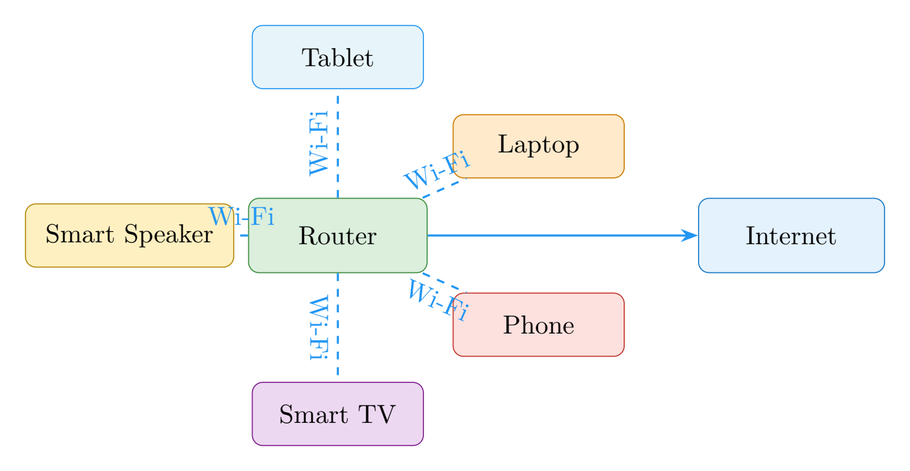

---

## Wi-Fi vs a Cable — What’s the Difference?

Some devices connect to the router using a physical cable called an **Ethernet cable**.
This is often faster and more reliable than Wi-Fi, but you have to stay in one place.

*[See table in print edition]*

---

> **📖 New Words**
>
>
> - ****Wi-Fi**** Wireless technology that uses radio waves to connect devices to a network.
> - ****Router**** A device that connects your home network to the internet and directs traffic.
> - ****Radio waves**** Invisible energy waves that carry Wi-Fi signals through the air.
> - ****Local network**** The private network inside your home that connects your devices together.
> - ****Ethernet**** A cable that connects a device directly to a router.
>

---

> **✋ Try It**
>
> **Trace the path!**
> On paper, draw:
>
> - A tablet in the bedroom.
> - A router in the hallway.
> - Wavy lines from the tablet to the router (those are Wi-Fi radio waves!).
> - A solid line from the router to a big cloud labelled **The Internet**.
>
> Now label each part:
> *device, Wi-Fi signal, router, ISP cable, internet*.
> Can you add a phone, a laptop, and a TV all connecting to the same router?

---

> **💡 Big Idea**
>
> **Wi-Fi** carries signals through the air using radio waves.
> The **router** receives those signals and connects your home
> to the wider internet — directing traffic in and out.

> **Dot:** *"We’ve left the house! Now we’re zooming toward a huge building full of powerful computers. Let’s go meet Sunny Server!"*

# Servers and Data Centres

*Every website, video, and game lives somewhere. But where? Come and visit the giant buildings that hold it all!*

> **Welcome to Server City**

## The Giant Warehouse of the Internet

Dot had zoomed through the Wi-Fi signal, past the router,
and along a cable into the bigger internet.

Up ahead was a colossal building, almost the size of several football fields,
humming with the sound of thousands of fans.
The lights blinked in long rows, like a city skyline made of computers.

> **Dot:** *"This is a **data centre"*
 — one of the busiest places on the internet!
  Somewhere inside, a friendly helper called Sunny Server is waiting for us.**

---

## What Is a Server?

A **server** is a powerful computer that stores information and sends it to people who ask for it.

> **⭐ Fun Fact**
>
> Google’s data centres process over 8.5 billion searches every single day. That’s about 99,000 searches every second!

When you open a website, your browser sends a request to a server.
The server finds all the pieces of that website — the words, the pictures, the buttons, the videos —
and sends them back to your browser.

> **🎨 Imagine This**
>
> Imagine a huge library.
> The librarian (the server) knows where every book (piece of information) is kept.
> When you ask for a book, the librarian fetches it and brings it to you.
> The server is the librarian.
> The books are the information.
> You are the person asking.

Inside the data centre, Dot found a row of tall metal shelves.
Each shelf held many flat computers stacked on top of each other.
One of them glowed a warm golden colour.

> **Sunny Server:** *"Hello! I store billions of web pages, photos, and videos. When someone asks for something I have, I pack it up and send it straight to them — as fast as I can!"*

---

## What Is a Data Centre?

A **data centre** is a large building that holds hundreds or even thousands of servers.

Data centres are carefully designed to keep all those servers running smoothly:

  - **Cooling systems** — Servers get very hot when they work hard, so powerful fans and air conditioners keep the temperature just right.
  - **Reliable power** — data centres have backup generators so that if the electricity goes out, the servers keep running.
  - **Security** — Only authorised people can get inside. Many have cameras, locks, and security guards.
  - **Lots of cables** — Miles and miles of cables connect the servers to each other and to the internet.

> **🎨 Imagine This**
>
> Picture an apartment building — but instead of flats with people,
> every flat is a server computer.
> The building manager (the data centre team) makes sure the heating works,
> the electricity stays on, and the right people have access.
> That building is the data centre.

---

> **🔄 Remember So Far**
>
>
> - The **internet** is a giant network of connected devices (Chapter 1).
> - **Browsers** take us to websites, which are stored somewhere on the internet (Chapter 2).
> - **Wi-Fi** and **routers** get your request out of your home (Chapter 3).
> - Now you have arrived at the **server** — the powerful computer that stores the website you asked for!
>

## Fetch and Send

> **🗺️ Quick Map**
>
> **What happens when you load a web page:**
>
> - Your browser sends a **request**: “Please send me this page!”
> - The request travels through Wi-Fi, the router, your ISP, and the internet to the server.
> - Sunny Server finds all the parts of that page:
> the text, images, and layout instructions.
> - The server packs them up and sends a **response** back.
> - The response travels back the same way to your device.
> - Your browser assembles all the parts and shows you the finished page.
>

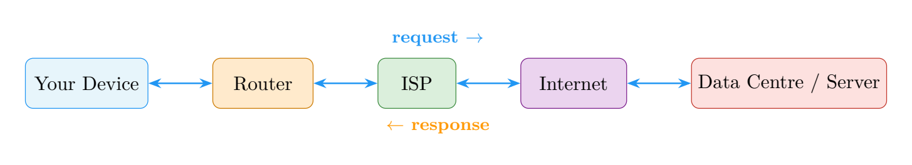

All of this happens in less than a second!

---

## Who Runs These Giant Buildings?

Many big companies around the world run data centres.
Large video and search websites have data centres on multiple continents,
so that no matter where you are in the world,
there is a server nearby that can answer your request quickly.

The closer the server is to you, the faster the response.
That is why some videos load almost immediately even from the other side of the world —
there is likely a copy stored on a server much closer to your home.

---

> **📖 New Words**
>
>
> - ****Server**** A powerful computer that stores information and sends it to people who ask.
> - ****Data centre**** A large building full of servers, kept cool, powered, and secure.
> - ****Request**** A message from your browser asking a server for information.
> - ****Response**** The answer from the server, containing the web page or data you asked for.
> - ****Cache**** A nearby copy of data stored to help deliver it faster.
>

---

> **✋ Try It**
>
> **Help Sunny Server pack the right pieces!**
> A visitor has asked for a web page about penguins.
> Circle all the things Sunny Server should pack and send:
>
>
*[See table in print edition]*

>
> *Everything related to penguins gets packed — the rest stays on the shelf!*

---

> **💡 Big Idea**
>
> **Servers** are powerful computers that store and send information.
> They live in giant buildings called **data centres**,
> which keep them cool, powered, and ready to answer millions of requests every second.

> **Sunny Server:** *"Next stop is even more amazing — the cables under the ocean! Some of my replies travel thousands of kilometres under the sea to reach you. Captain Cable will show you how!"*

# Undersea Cables

*The internet can send a message from one side of the world to the other in less than a second. How? By racing through giant cables laid on the floor of the ocean!*

> **Deep-Sea Data Adventure**

## Crossing the Ocean

Dot had been sent all the way from Sam’s tablet in one country
to a server in another — but to get there, Dot had to cross the sea.

There were no bridges.
No aeroplanes for data packets.

Instead, Dot arrived at a small building by the beach.
The building looked ordinary from the outside, but inside was something extraordinary:
a thick cable, smooth and dark, disappearing into the water.

A gruff but friendly voice echoed up from the deep.

> **Captain Cable:** *"Ahoy, Dot! Welcome to the cable station. I am the longest traveller in the internet — I stretch from this beach all the way to the other side of the ocean. Hop in, and I’ll carry you at the speed of light!"*

---

> **🔄 Remember So Far**
>
>
> - Your request has already travelled from your device through **Wi-Fi**, past the **router**, to your ISP, and reached a **server** in a data centre.
> - But what if the server is in a completely different country, across an ocean?
> - That is where **undersea cables** come in — the secret highways under the sea!
>

## What Are Undersea Cables?

**Undersea cables** (also called **submarine cables**) are thick bundles of cables
laid on the floor of the ocean.
They carry internet data between continents.

These cables are incredibly important.
When you watch a video from another country, send an email to a faraway friend,
or look at a website based overseas — your data almost certainly travels through one of these cables.

> **⭐ Fun Fact**
>
> The first transatlantic telegraph cable was laid in 1858. Queen Victoria and President Buchanan exchanged the first messages — it took 16 hours to transmit 98 words!

> **🎨 Imagine This**
>
> Imagine a spaghetti noodle stretched from one side of the ocean to the other.
> Now imagine it was actually a bundle of **optical fibres** —
> threads thinner than a human hair that carry flashes of light.
> Each flash of light is a piece of data.
> Billions of flashes per second race through those thin threads.
> **That is how an undersea cable works.**

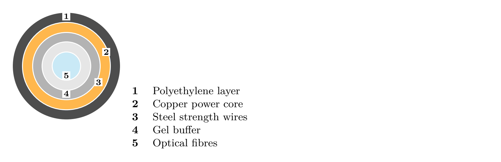

---

## How Are Undersea Cables Made and Laid?

Building an undersea cable is an enormous engineering project.

> **🗺️ Quick Map**
>
> **Building a submarine cable, step by step:**
>
> - Engineers design a route across the ocean floor, avoiding mountains and active volcanoes.
> - A special ship called a **cable-laying ship** carries thousands of kilometres of cable, coiled in its hold.
> - The ship sails slowly across the ocean, lowering cable carefully over the stern.
> - Near the shore, the cable is buried under the seabed to protect it from anchors and fishing gear.
> - In deep water, the cable rests gently on the ocean floor.
> - Engineers at each end connect the cable to the internet network on land.
>

A single cable can be longer than the distance from Earth to the Moon!

---

## Inside the Cable

From the outside, an undersea cable looks like a thick rope.
But look inside and you find many carefully engineered layers:

  - **Optical fibres** — the core. Hair-thin glass threads that carry data as pulses of light.
  - **Protective layers** — plastic, steel wires, and waterproof coatings that shield the fibres from pressure and salt water.
  - **Power conductor** — a copper wire that carries electricity to power amplifiers along the cable.

> **🎨 Imagine This**
>
> Think of the cable like a chocolate-coated biscuit.
> The chocolate outside protects the biscuit inside.
> The optical fibre is the delicious biscuit —
> the part that actually does the important job.
> Everything else is protection.

---

## How Many Cables Are There?

There are more than 400 active undersea cable systems around the world,
totalling over 1.3 million kilometres of cable.

If you laid them end to end, they would reach around the Earth more than 30 times!

These cables carry about 99\% of all internet data that travels between continents.
Despite all the talk of satellites, it is really cables under the ocean that keep the world connected.

---

## Can Cables Break?

Yes, occasionally.
Cables can be damaged by:

  - Ships’ anchors
  - Fishing gear
  - Underwater landslides
  - Shark bites (sharks are occasionally attracted to the electromagnetic fields)

When a cable breaks, a special repair ship sails out, hooks the cable up from the ocean floor,
fixes the break, and lowers it back down.
It is like surgery on the ocean floor!

---

> **📖 New Words**
>
>
> - ****Undersea cable**** A cable on the ocean floor that carries internet data between continents.
> - ****Optical fibre**** A thin glass thread that carries data as pulses of light.
> - ****Cable-laying ship**** A ship designed to carry and place undersea cables across the ocean.
> - ****Amplifier**** A device along the cable that boosts the light signal so it does not fade over distance.
>

---

> **✋ Try It**
>
> **Draw the ocean route!**
> On a map of the world (or draw your own simple outline), draw:
>
> - A dot on North America — that is Sam’s tablet sending a message.
> - A dot on Europe — that is the server receiving it.
> - A line along the bottom of the Atlantic Ocean connecting the two dots.
> - A small ship icon near the top of the ocean (a cable-laying ship!).
> - Some small fish around the cable on the ocean floor.
>
> *That glowing line on the ocean floor?  That is Dot’s highway!*

---

> **💡 Big Idea**
>
> Most internet data that travels between countries and continents
> moves through **undersea cables** — bundles of optical fibres on the ocean floor
> that carry information as pulses of light, faster than you can blink.

> **Captain Cable:** *"Safe travels, Dot! You have crossed the ocean. Now, on the other side, let’s see how all those tiny messages and videos are broken into pieces for the journey. Meet the packet crew!"*

# How Messages and Videos Travel

*A video is enormous. How can something so big travel so fast? The secret is that it does not travel whole — it is broken into thousands of tiny pieces called **packets*
!
**
> **Packets on the Move**

## Dot’s Secret: There Is More Than One Dot

Dot had been humble about something.

  “I am not alone,” Dot admitted.

When Sam sent a photo to a friend, it did not travel as one big lump.
It was cut into hundreds of small pieces.
Each piece was wrapped in an envelope with an address written on it.
And each envelope was a *packet*.

Suddenly the air around Dot filled with hundreds of identical little glowing dots,
all labelled with numbers: Packet 1, Packet 2, Packet 3…

> **Dot:** *"We are all parts of the same photo! We might travel different routes to get there, but we will all arrive and get put back together at the end. It is like posting a jigsaw puzzle one piece at a time."*

---

## What Is a Packet?

A **packet** is a small chunk of data.

> **⭐ Fun Fact**
>
> A single 4K video stream sends about 25 Megabits of data every second — that’s roughly 3,000 packets flying through the internet every second just for your film!

When you send anything over the internet — a message, a photo, a video — it is split into packets.
Each packet contains:

  - A piece of the data (part of the photo, video, or message).
  - A **header** — information about where the packet came from, where it is going,
        and what number it is in the sequence.

> **🎨 Imagine This**
>
> Imagine sending a 1000-piece jigsaw puzzle through the post.
> You cannot fit all 1000 pieces in one envelope.
> So you put 10 pieces in each envelope, label each envelope with a number,
> and post them all.
> At the other end, the person sorts the envelopes by number
> and puts the puzzle back together.
> **That is exactly how packets work.**

---

## How Do Packets Find Their Way?

Packets do not all have to take the same route.
Along the internet highway, special computers called **routers** read the address on each packet
and direct it toward the destination.

If one route is busy or broken, a router sends the packet a different way.

> **🗺️ Quick Map**
>
> **The packet journey:**
>
> - A photo is split into 200 packets, each numbered 1 to 200.
> - All 200 packets set off from Sam’s device.
> - Routers along the way read each packet’s address and forward it.
> - Some packets take a northern route; others take a southern route.
> - All 200 packets arrive at the destination device.
> - The device sorts them back into order using the numbers.
> - The device reassembles the original photo. Done!
>

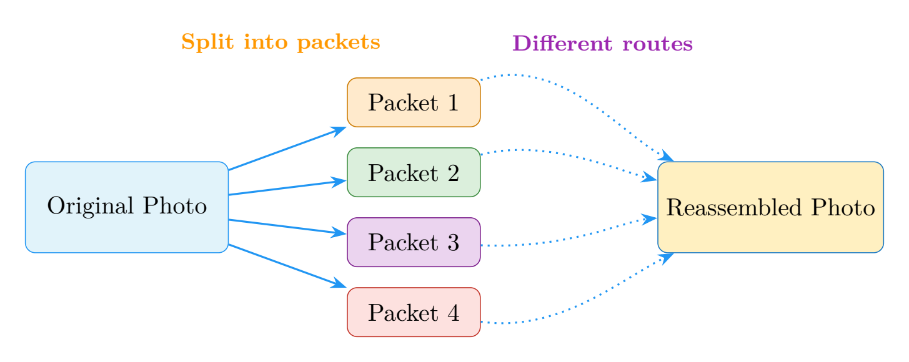

> **Dot:** *"Even if I arrive before Packet 50, the device waits for everyone. If a packet gets lost, the device asks for it to be sent again. Nobody gets left behind!"*

---

> **🔄 Remember So Far**
>
>
> - Data is split into tiny **packets**, each with a number and a destination address.
> - **Routers** direct each packet toward its destination — they can take different routes!
> - At the other end, all the packets are put back together in the right order.
>
> Now let’s learn the *rules* that make all of this work smoothly…

## The Rules of the Road: TCP/IP

The internet follows strict rules so that packets behave properly.
The most important set of rules is called **TCP/IP**.

  - **IP (Internet Protocol)** — gives every device on the internet its own address
        (called an **IP address**) and makes sure packets have the right destination written on them.
  - **TCP (Transmission Control Protocol)** — makes sure all the packets arrive safely.
        If a packet is missing, TCP asks for it to be sent again.

> **🎨 Imagine This**
>
> Think of IP as the postal address system — every device has an address.
> Think of TCP as a very careful delivery service that checks every item off a list
> and will not sign off until every single package has arrived safely.

---

## What About Videos?

A video is made of thousands of still images flashed one after another,
plus an audio track.
A one-minute video can be made up of millions of packets.

When you **stream** a video, the packets are not all downloaded first.
Instead, packets keep arriving just fast enough to play the video smoothly.
That is why if your Wi-Fi is slow, the video might pause —
it is waiting for the next wave of packets to arrive!

---

> **📖 New Words**
>
>
> - ****Packet**** A small chunk of data sent across the internet, with a numbered label and address.
> - ****Header**** The label on a packet that says where it came from, where it is going, and its sequence number.
> - ****Router**** A device that reads packets and directs them toward their destination.
> - ****IP**** Internet Protocol — the addressing system of the internet.
> - ****TCP**** Transmission Control Protocol — the system that makes sure all packets arrive correctly.
> - ****Streaming**** Receiving and playing data (like a video) as it arrives, rather than waiting for it all first.
>

---

> **✋ Try It**
>
> **Be the packet sorter!**
> Below are 8 packets out of order.
> Number them correctly, then “play” the message:
>
>
*[See table in print edition]*

>
> *Correct order: “Hello, my name is Dot, and I love learning about things like the internet!”*
> Imagine doing that with millions of pieces of a video!

---

> **💡 Big Idea**
>
> Information on the internet travels as tiny pieces called **packets**.
> Each packet finds its own route, and they are all put back together
> in the right order when they arrive.

> **Dot:** *"Amazing! Now you know my biggest secret — I’m made of packets! Next up, let’s meet Scout Search and find out how search engines help you find exactly what you are looking for in the giant internet library."*

# Search Engines

*There are billions of pages on the internet. How do you find exactly the one you need? Scout Search has a very, very big index!*

> **Detective Time with Scout Search**

## The World’s Biggest Library

Imagine a library with one billion books.
Walking along the shelves looking for one title could take years.

Sam had a question: “How do rainbows form?”
But there were billions of pages on the internet.
Where to start?

A figure appeared, wearing a long coat and holding a giant flashlight and a stack of index cards.
That was Scout Search.

> **Scout Search:** *"Don’t worry! I’ve already visited every page on the internet, read them all, and made a huge organised list. Tell me your question and I’ll find the best answers in a flash!"*

---

## What Is a Search Engine?

A **search engine** is a service that helps you find information on the internet.

> **⭐ Fun Fact**
>
> Google’s search index contains hundreds of billions of web pages and is over 100 million gigabytes in size!

You type a question or some keywords into a search box.
The search engine looks through its enormous index and shows you a list of pages
that are likely to help.

> **🎨 Imagine This**
>
> Imagine a super-organised librarian who has read every single book in the library.
> She has written a card for every word in every book,
> saying which books contain that word and on which page.
> When you ask for help, she checks the cards and brings you the most useful books first.
> That librarian is a search engine.
> The cards are the **index**.

---

## How Does a Search Engine Work?

A search engine has three main jobs:

### 1. Crawling

Special programmes called **crawlers** (or “spiders” or “bots”) roam the internet
constantly, visiting web pages.
When a crawler finds a page, it follows all the links on that page to find more pages,
then follows the links on those pages — and so on, endlessly.

> **🎨 Imagine This**
>
> Imagine a spider walking across a huge web.
> Every point on the web connects to more threads.
> The spider visits every point, reads what is there, and notes it down.
> That is what a web crawler does.

### 2. Indexing

After crawling, the search engine builds an **index** —
a massive organised list of words, phrases, and topics,
linked to all the pages where they appear.

This index is so large it would fill millions of filing cabinets,
but computers can search through it in less than a second.

### 3. Ranking

When you type a search query, the search engine does not just list every matching page.
It **ranks** them — it tries to show you the most useful, trustworthy, and relevant pages first.

Ranking is decided by many signals, including:

  - How many other websites link to a page (if lots of people point to it, it is probably useful).
  - How well the words on the page match your question.
  - How new or up-to-date the page is.
  - How easy the page is to read.

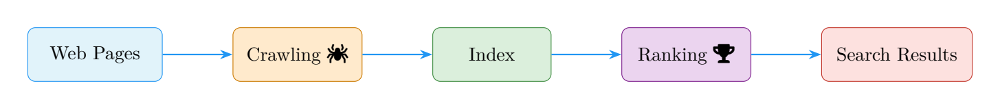

---

## Searching Smarter

> **Scout Search:** *"Not all search words are equal! The better your search words, the better the results. Think of it like describing something clearly to a new friend."*

> **🗺️ Quick Map**
>
> **Good vs better search words:**
>
>
*[See table in print edition]*

>

Specific words help the search engine understand exactly what you want.

---

## Are All Results True?

Search engines are very good at finding pages — but not every page on the internet is accurate.

  - Look for well-known, trusted sources: encyclopaedias, museums, universities.
  - If something seems surprising, check it in more than one place.
  - Ask a trusted adult if you are not sure whether a result is reliable.

> **💡 Big Idea**
>
> Search engines are incredibly helpful, but you still need to think!
> Being a good searcher also means being a **careful reader**.

---

> **📖 New Words**
>
>
> - ****Search engine**** A service that helps you find information on the internet by searching an index.
> - ****Crawler**** A programme that visits web pages automatically to gather information for the index.
> - ****Index**** The huge organised list of words and pages that a search engine builds.
> - ****Ranking**** The process of sorting search results to show the most useful ones first.
> - ****Query**** The words or question you type into a search box.
>

---

> **✋ Try It**
>
> **Write the best search words!**
> For each question below, write the search words you would use:
>
> - You want to know what pandas eat.
> - You want to find a recipe for banana bread.
> - You want to learn the name of the tallest mountain.
> - You want to know how a rainbow forms.
> - You want to find out when the next solar eclipse will happen.
>
> *Compare your answers with a friend.
> Whose search words do you think Scout Search would find most useful?*

---

> **💡 Big Idea**
>
> A **search engine** crawls the internet, builds a giant index, and ranks results
> so you can find the most useful pages in seconds.
> Good search words and careful reading are your best tools.

> **Scout Search:** *"Now you know how to search like a pro! Next up — what IS the cloud? Is it really made of water vapour? Spoiler: not quite. Cloud Pal will explain!"*

# The Cloud

*People say things are “in the cloud”. But what does that actually mean? Cloud Pal is here to reveal the surprising truth!*

> **Cloud Clues Unlocked**

## The Reveal

Sam had drawn a picture on the tablet.
The tablet said: “Saved to the cloud.”

Sam looked out the window at the grey, rainy sky.

  “Is my drawing floating up there somewhere?”

A fluffy, smiling cloud shape floated over.
But then it unzipped itself — and inside was a row of servers, blinking lights and all.

> **Cloud Pal:** *"Surprise! I’m not actually a sky cloud. That is just the nickname people gave me because I seem magical and hard to see. Really, I am just computers — lots and lots of computers — in buildings far away. And right now, your drawing is safely stored on one of them!"*

---

## What Is the Cloud?

**The cloud** is a way of storing, accessing, and using files, programmes, and computing power
on servers located far away from your device — via the internet.

> **⭐ Fun Fact**
>
> Every minute, people upload around 500 hours of video to YouTube, share 695,000 Instagram Stories, and send 16 million text messages — all stored in the cloud!

Instead of keeping everything on your own tablet or laptop,
the cloud lets you keep things on servers somewhere else.
As long as you have an internet connection, you can get to your stuff
from any device, anywhere in the world.

> **🎨 Imagine This**
>
> Imagine you kept all your favourite toys in a giant warehouse instead of your bedroom.
> Any time you wanted to play with one, you could ask the warehouse to send it to you.
> When you visited your grandparents and wanted your favourite toy,
> you could get it there too — same warehouse, different location.
> **The cloud is that warehouse. The internet is the road to it.**

---

## What Can the Cloud Do?

### Cloud Storage

Cloud storage means saving your files on remote servers.

  - Photos you take on a phone can be automatically backed up to the cloud.
  - If you lose or break your phone, the photos are still safe.
  - You can look at those photos on a laptop, tablet, or a friend’s phone.

### Cloud Programmes

Some programmes live in the cloud and run on servers, not your device.

  - You write a document in a browser tab — the document is stored on a cloud server.
  - Multiple people can work on the same document at the same time, from different countries.

### Cloud Computing

Really powerful computing tasks can be done on cloud servers.

  - Scientists analysing huge amounts of data can rent cloud computing power.
  - Games can run on cloud servers and stream to your screen like a video.

---

## The Cloud Is Very Much on the Ground

> **Cloud Pal:** *"I know — calling it a cloud is a bit misleading. Really, I am data centres — big buildings full of servers, cooling systems, and cables. The clouds in the diagrams are just a shorthand for saying “somewhere on the internet — we don’t need to know exactly where.”"*

Big companies run enormous cloud services around the world.
These data centres consume a lot of electricity and water for cooling,
so engineers are always working on ways to make them more efficient and environmentally friendly.

---

## Why the Cloud Is Useful

> **🗺️ Quick Map**
>
> **Cloud benefits at a glance:**
>
> - **Access anywhere** — your files are available on any device.
> - **Backup and safety** — if your device breaks, your data is not lost.
> - **Sharing** — easily share files or work on them together.
> - **No need for huge storage** — your device does not need to hold everything.
>

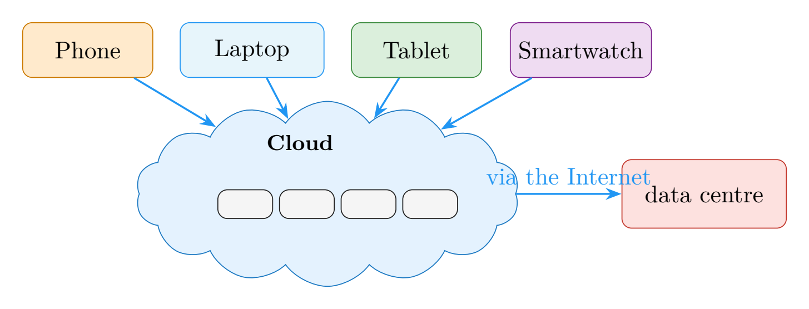

### Things to Think About

  - You need an internet connection to access cloud files.
  - You are trusting a company to keep your files safe and private.
  - It is good to know that the cloud is not magic — it is real physical computers
        that need electricity, maintenance, and protection.

---

> **📖 New Words**
>
>
> - ****The cloud**** Servers accessed via the internet, used to store data or run programmes remotely.
> - ****Cloud storage**** Saving files on remote servers so they can be reached from any device.
> - ****Backup**** A copy of data stored safely somewhere else in case the original is lost.
> - ****Streaming**** Receiving and using data (like a video or game) directly from a server as you need it.
> - ****Remote server**** A server that is in a different physical location from the user.
>

---

> **✋ Try It**
>
> **On the device or in the cloud?**
> For each of the following, mark whether it is likely stored **on your device**
> or **in the cloud**:
>
>
*[See table in print edition]*

>
> *(Hint: many things can be both!  A song might be stored on your device AND in the cloud.)*

---

> **💡 Big Idea**
>
> **The cloud** is not floating in the sky —
> it is servers in buildings on the ground, connected to you through the internet.
> It lets you store, share, and access your files and programmes from anywhere.

> **Cloud Pal:** *"You have learned so much on this journey! The last chapter is all about **you"*
 — how to be a smart, safe, and curious explorer
  in this amazing internet world.  See you at the finish line!**

# Stay Safe and Curious

*You have learned the secret life of the internet. Now it is time to become a smart, safe, and curious explorer!*

> **Final Quest: Safe Explorer Mode**

## The Explorer’s Badge

Dot, Bee Browser, Rory Router, Willa Wi-Fi, Sunny Server, Captain Cable,
Scout Search, and Cloud Pal had all gathered together.

They looked at Sam — who had come a very long way since that first question
about the dolphin video.

> **Dot:** *"You have followed me through Wi-Fi signals, undersea cables, data centres, and packet highways. Now it is time for your final challenge: learning how to explore the internet **safely and wisely"*
.**

Each character reached into a bag and pulled out a tool.
Together they built the **Digital Explorer’s Backpack**.

---

## The Digital Explorer’s Backpack

### Tool 1: A Strong Password

A **password** is like a key to your online account.
A strong password:

  - Is long (at least 8 characters).
  - Mixes letters, numbers, and symbols.
  - Is different for every account.
  - Is never shared with anyone except a trusted adult.

> **🎨 Imagine This**
>
> Imagine your account is a house.
> A weak password is like leaving the front door open.
> A strong password is a sturdy lock.
> And sharing your password with someone you do not trust is
> like handing them a copy of your key.

### Tool 2: Think Before You Click

Not every link on the internet is safe.
Some links try to trick you into giving personal information
or downloading something harmful.

  - If an email or message seems strange, do not click on links in it.
  - If a website asks for your full name, address, or phone number and you did not expect it — stop.
  - If something feels wrong, ask a trusted adult.

> **Scout Search:** *"Good searchers and safe explorers both check twice. If something seems too exciting, too scary, or too good to be true — it probably needs a second look."*

### Tool 3: The Buddy Rule

Just as you would not explore a strange place alone in real life,
it is wise to have a trusted adult you can talk to about what you see online.

  - Tell a parent, carer, or teacher if you see something that worries you.
  - Ask an adult before signing up for a new website or app.
  - Remember: you can always close the page or walk away.

### Tool 4: Be Kind Online

The internet connects you to real people all over the world.

  - Treat people online the same way you would in person — with kindness and respect.
  - If someone says something unkind to you online, it is not your fault.
        Tell a trusted adult.
  - Think before posting or sending: *“Would I say this to someone’s face?”*

> **🎨 Imagine This**
>
> Words online are real words.
> A kind message can make someone’s day.
> An unkind one can really hurt — even when you cannot see the person’s face.

### Tool 5: Check Whether Things Are True

Not everything on the internet is accurate.
Anyone can publish almost anything.

  - Look for well-known, trusted sources.
  - If something surprising is claimed, check another reliable source.
  - Ask a trusted adult or librarian if you are unsure.

### Tool 6: Balance Your Screen Time

The internet is wonderful — but so is the world away from screens.

  - Take breaks from screens regularly.
  - Notice how you feel after a long session online.
  - Balance internet time with physical activity, reading, and face-to-face time with friends and family.

---

## Smart Explorer Choices

> **🗺️ Quick Map**
>
> **Smart choice or not so smart?**
>
>
*[See table in print edition]*

>

---

## Digital Explorer’s Code of Honour

> **🎨 Imagine This**
>
> A real explorer does not just know facts — they make promises.
> Read this code aloud and sign it like a true digital adventurer.

  - I will protect my passwords and keep personal information private.
  - I will pause and think before I click links, downloads, or pop-ups.
  - I will check facts in more than one trusted place before sharing.
  - I will be kind in comments, chats, games, and messages.
  - I will ask a trusted adult for help when something feels wrong.
  - I will balance screen time with rest, play, and real-world adventures.

    **Explorer’s Signature:**
    **Date:**

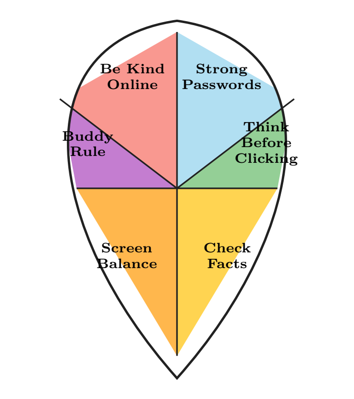

---

## You Are a Digital Explorer!

All the characters gathered around Sam one last time.

> **Willa Wi-Fi:** *"You know how I carry signals through the air now!"*

> **Rory Router:** *"And how I send things the right way!"*

> **Sunny Server:** *"And how I store all that information!"*

> **Captain Cable:** *"And how data races under the ocean to reach you!"*

> **Bee Browser:** *"And how to visit any website you want!"*

> **Cloud Pal:** *"And what I really am!"*

> **Scout Search:** *"And how to find the answers you need!"*

> **Dot:** *"And you know that the internet is not magic — it is **science, engineering, and millions of clever ideas"*

  working together to connect the world.
  Stay curious.  Stay kind.  Stay safe.**
  And remember — every explorer started by asking one simple question.
  Keep asking yours!

---

> **📖 New Words**
>
>
> - ****Password**** A secret code that protects an online account.
> - ****Privacy**** Keeping personal information to yourself and choosing who sees it.
> - ****Phishing**** A trick that tries to get you to share personal information by pretending to be trustworthy.
> - ****Screen time**** The amount of time spent using a screen-based device.
> - ****Digital citizen**** A person who uses the internet responsibly, kindly, and safely.
>

---

> **✋ Try It**
>
> **Pack your Digital Explorer’s Backpack!**
> Draw a backpack and fill it with six items:
>
> - A padlock — for a **strong password**.
> - A magnifying glass — for **checking facts**.
> - A shield — for **thinking before clicking**.
> - A smiley face — for **being kind online**.
> - A pair of hands — for **the buddy rule** (always have a trusted adult).
> - A clock — for **balancing screen time**.
>
> *Now your backpack is ready.  Go explore — carefully, kindly, curiously!*

---

> **💡 Big Idea**
>
> The internet is amazing — but **you** are the most important part.
> Stay **curious**, stay **kind**, and stay **safe**.
> Every great explorer knows the world is full of wonderful things to discover.

# Glossary

Glossary

- ****Amplifier**** A device along an undersea cable that boosts the light signal so it does not fade over distance.
*(Chapter 5)*

- ****Backup**** A copy of data stored safely somewhere else in case the original is lost.
*(Chapter 8)*

- ****Browser**** A programme (like Chrome or Safari) that lets you visit websites.
*(Chapter 2)*

- ****Cable-laying ship**** A ship designed to carry and place undersea cables across the ocean.
*(Chapter 5)*

- ****Cache**** A nearby copy of data stored to help deliver it faster.
*(Chapter 4)*

- ****Cloud storage**** Saving files on remote servers so they can be reached from any device.
*(Chapter 8)*

- ****Crawler**** A programme that visits web pages automatically to gather information for the search engine’s index.
*(Chapter 7)*

- ****Data centre**** A large building full of servers, kept cool, powered, and secure.
*(Chapter 4)*

- ****Device**** Any gadget that can connect to the internet — phone, tablet, laptop.
*(Chapter 1)*

- ****DNS**** Domain Name System — a system that turns website names into number addresses.
*(Chapter 2)*

- ****Ethernet**** A cable that connects a device directly to a router.
*(Chapter 3)*

- ****Header**** The label on a packet that says where it came from, where it is going, and its sequence number.
*(Chapter 6)*

- ****HTML**** HyperText Markup Language — the language used to build web pages.
*(Chapter 2)*

- ****Index**** The huge organised list of words and pages that a search engine builds.
*(Chapter 7)*

- ****Internet**** A huge worldwide network that connects billions of devices.
*(Chapter 1)*

- ****IP**** Internet Protocol — the addressing system of the internet.
*(Chapter 6)*

- ****IP address**** A number that identifies a device or server on the internet.
*(Chapter 2)*

- ****ISP**** Internet Service Provider — the company that connects your home to the internet.
*(Chapter 1)*

- ****Local network**** The private network inside your home that connects your devices together.
*(Chapter 3)*

- ****Network**** A group of devices linked together so they can share information.
*(Chapter 1)*

- ****Optical fibre**** A thin glass thread that carries data as pulses of light.
*(Chapter 5)*

- ****Packet**** A small chunk of data sent across the internet, with a numbered label and address.
*(Chapters 1, 6)*

- ****Password**** A secret code that protects an online account.
*(Chapter 9)*

- ****Privacy**** Keeping personal information to yourself and choosing who sees it.
*(Chapter 9)*

- ****Query**** The words or question you type into a search box.
*(Chapter 7)*

- ****Radio waves**** Invisible energy waves that carry Wi-Fi signals through the air.
*(Chapter 3)*

- ****Ranking**** The process of sorting search results to show the most useful ones first.
*(Chapter 7)*

- ****Remote server**** A server that is in a different physical location from the user.
*(Chapter 8)*

- ****Request**** A message from your browser asking a server for information.
*(Chapter 4)*

- ****Response**** The answer from the server, containing the web page or data you asked for.
*(Chapter 4)*

- ****Router**** A device that connects your home network to the internet and directs traffic.
*(Chapters 3, 6)*

- ****Search engine**** A service that helps you find information on the internet by searching an index.
*(Chapter 7)*

- ****Server**** A powerful computer that stores information and sends it to people who ask.
*(Chapter 4)*

- ****Streaming**** Receiving and playing data (like a video) as it arrives, rather than waiting for it all first.
*(Chapters 6, 8)*

- ****TCP**** Transmission Control Protocol — the system that makes sure all packets arrive correctly.
*(Chapter 6)*

- ****The cloud**** Servers accessed via the internet, used to store data or run programmes remotely.
*(Chapter 8)*

- ****Undersea cable**** A cable on the ocean floor that carries internet data between continents.
*(Chapter 5)*

- ****URL**** Uniform Resource Locator — a web address; the unique location of a website.
*(Chapter 2)*

- ****Website**** A collection of pages on the internet, stored on a server.
*(Chapter 2)*

- ****Wi-Fi**** Wireless technology that uses radio waves to connect devices to a network.
*(Chapter 3)*